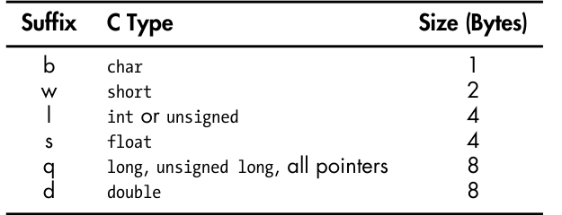

#寄存器

在X86语言中需要64位的寄存器，同时也可以使用32或者16位。具体如下：

#指令结构

格式通常为 操作命令  源操作数  和目的操作数

用$表示立即数（常数）

%寄存器：表示操作寄存器

内存操作：用( )表示 或者直接出现内存地址

注意，内存格式不能同时在一条指令中作为目的和源操作数

#指令后缀

指令后缀表示要操作数的大小。

#基础指令

#算数指令

#位移指令

逻辑位移是指空位都补上0，算术位移要考虑数据是否为有符号数，如果是有符号数，左移相当于逻辑左移，右移如果是正数，则补0，负数则补1。

#位运算

#lea指令

只进行算数运算，无论操作数是什么。不访问内存。