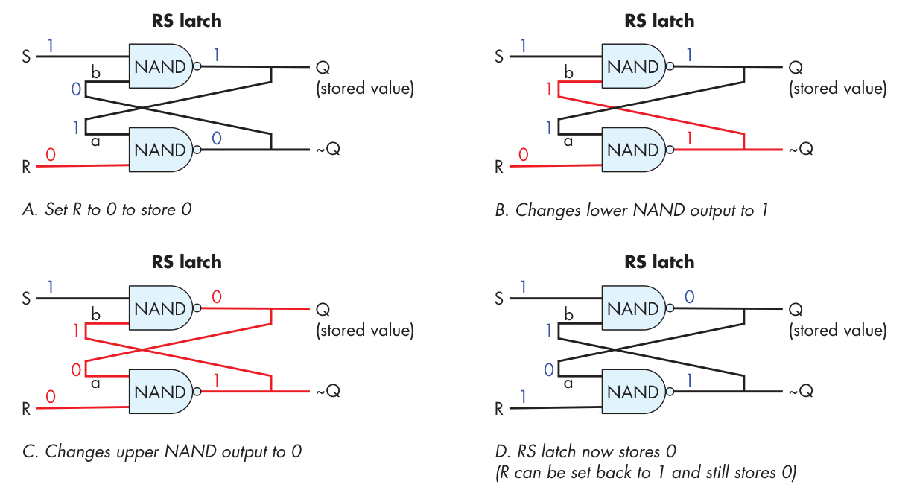

#CPU

##算术电路

一位的加法电路首先确定输入输出、真值表、逻辑表达式、逻辑电路

如果要打造Nbit的加法器，需要三个输入，两个输出。

##控制电路

多路复用器，此例为双向多路复用器，当S=1时允许A通过，等于0时，允许B通过。

N对1的多路复用器，需要log2(N)个选择位。

##存储电路

SRAM倾向于用于存储器层次结构的顶部（CPU寄存器和芯片上的高速缓存存储），而DRAM用于主存储（RAM）存储。

RS锁存器

当R和S同时为一时，会存储Q的值，当R和S有一个不为1时，会改变Q的值。分析时，假设Q已经存在值。

D锁存器

保证RS不同时为0.门控 D 锁存器的数据输入（D）是要存储到电路中的值（可以是 0 或 1）。写使能（WE）输入控制将一个值写入 RS 锁存器。当 WE 为 0 时，两个 NAND 门的输出都为 1，导致 R 和 S 的输入值为 1（RS 锁存器存储一个值）。只有当 WE 为 1 时，门控 D 锁存器才将 D 的值写入 RS 锁存器。由于在将数据输入（D）发送到底部 NAND 门之前会反转该值，所以上面或下面的 NAND 门的输入只有一个为 1。这意味着当 WE 为 1 时，R 或 S 中只有一个为 0。

寄存器

由多个D锁存器组成。寄存器电路有两个输入值：一个 32 位数据值和一个一位写使能信号。在内部，每个一位 D 锁存器的 D 输入都取自寄存器的 32 位数据输入中的一个比特位，每个一位 D 锁存器的写使能（WE）输入都取自寄存器的 WE 输入。

##ALU

##寄存器组

它的每个读选择输入（Sr0和Sr1）被送入其中一个多路复用器以选择相应输出的寄存器值。寄存器文件的数据输入（Data in线）被发送到每个寄存器电路，其写使能（WE）输入首先通过一个解多路器（DMUX）电路，然后再发送到每个寄存器电路。解多路器电路接收一个输入值，并选择要将该值发送到的N个输出之一，同时将其余的N-1个输出设为0。写选择输入（Sw）送到解多路器电路以选择WE值的目标寄存器。当寄存器文件的WE输入值为0时，不会将任何值写入寄存器，因为每个寄存器的WE位也变为0（因此，Data in不会对寄存器中存储的值产生影响）。当WE位为1时，解多路器将WE位值为1仅发送到由写选择输入（Sw）指定的寄存器，结果只将Data in值写入所选的寄存器中。

##指令执行

##时钟电路

##流水线技术